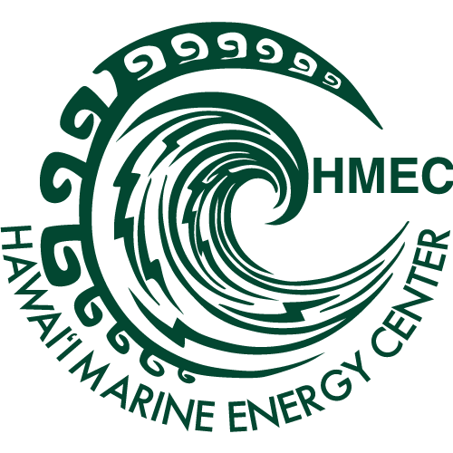

HMEC is working to accelerate marine energy development in Hawaii and across the Pacific region. Achieving that goal requires more than research, projects, and partnerships—it requires a way to capture knowledge, share lessons learned, and make valuable resources accessible to the people who need them.

As the marine energy community continues to grow, HMEC is building not only a website — visit us at [hmec.us](https://www.hmec.us/) — but a shared knowledge hub that helps connect information, people, and opportunities. This repository serves as part of that effort by collecting technical resources, tutorials, project documentation, software guidance, and institutional knowledge in a form that can be maintained, expanded, and shared over time.

Whether you are a student, researcher, educator, industry professional, or simply curious about marine energy, we hope these resources help you learn, contribute, and build upon the work of others.

{ style="display: block; margin: 0 auto;" }
