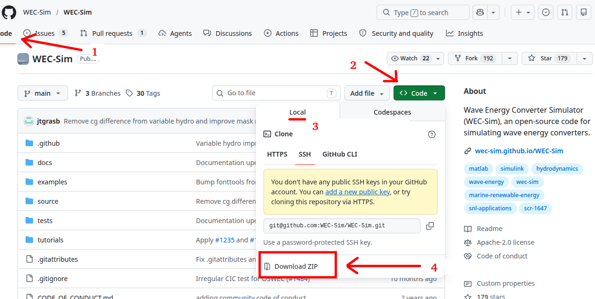
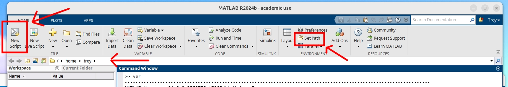

# WEC-Sim
WEC-Sim is maintained as a [GitHub repository](https://github.com/WEC-Sim/wec-sim), similar to how these course materials are distributed. The official [WEC-Sim documentation](https://wec-sim.github.io/WEC-Sim/main/user/getting_started.html#download-wec-sim) typically recommends installation using “[git](https://git-scm.com/)”, which is a version control tool commonly used to interact with GitHub repositories.

Using ++"git"++ allows users to directly “clone” repositories to their computer, track version history, receive updates, contribute changes, and synchronize local files with the latest development version of a project. In research and software development environments, ++"git"++ is widely used because it provides a structured and reproducible way to manage evolving codebases and collaborate across teams.

For this course, however, we will use a simpler **static installation** method by downloading the latest WEC-Sim release as a ZIP archive. [Figure 1](#wecsim-zip) below shows how to find and download the ZIP archive from the [WEC-Sim repository](https://github.com/WEC-Sim/wec-sim). This approach avoids the need to install and learn ++"git"++ while still providing access to the required software and examples used throughout the course.

{#wecsim-zip}

*Figure 1: Download WEC-Sim ZIP archive.*

!!! note "WEC-Sim Software"
    You will notice that WEC-Sim is essentially just a directory/folder containing MATLAB scripts, functions, examples, and supporting files. Unlike traditional applications, there is no separate *installation executable*.

!!! note "Note on Language"
    I'll use the words "folder" and "directory" interchangeably herein.
    
To use WEC-Sim, **MATLAB simply needs to know where the files are located** so they can be accessed and executed within the MATLAB environment. This is done by adding the installation directory to MATLAB's working ++"path"++. The official [WEC-Sim documentation](https://wec-sim.github.io/WEC-Sim/main/user/getting_started.html#install-wec-sim) gives instructions on how to automate this step by utilizing MATLAB's `startup.m` script, which is nothing more than a script that runs when you first start MATLAB. We'll highlight the main points below and let you decide if you want to automate the process.

After downloading the ZIP file — and extracting/unzipping the contents — you can move the parent WEC-Sim folder to wherever you like! It doesn't matter where you keep it, you just need to know where it is located (i.e., the ++"path"++). Expand the dropdowns below for your operating system to see a few examples:

<details markdown="1">
  <summary>Windows</summary>
    
  | Storage Location | Example Path |
  | -------- | -------- |
  | Downloads   | C:\Users\troy\Downloads\WEC-Sim-main   |
  | Documents   | C:\Users\troy\Documents\WEC-Sim-main   |
</details>

<details markdown="1">
  <summary>Linux</summary>
    
  | Storage Location | Example Path |
  | -------- | -------- |
  | Downloads   | /home/troy/Downloads/WEC-Sim-main   |
  | Documents   | /home/troy/Documents/WEC-Sim-main   |
  
</details>

<details markdown="1">
  <summary>Mac</summary>
    
  | Storage Location | Example Path |
  | -------- | -------- |
  | Downloads   | /Users/troy/Downloads/WEC-Sim-main   |
  | Documents   | /Users/troy/Documents/WEC-Sim-main   |
</details>
<br>
The ++"path"++ structure is unique to your file system and username. It's basically an "address". If you rename the "WEC-Sim-main" parent directory to something else (e.g., "WECSim_version_6"), then your ++"path"++ will change. Also, in the examples above, I've used "troy" as the username. **On your computer, the ++"path"++ will be different!**

!!! warning "Check Point"
    Make sure you understand what a ++"path"++ is and how to identify **your** WEC-Sim directory ++"path"++. This is often a cause for confusion with beginners.

!!! note "Absolute vs Relative path"
    An **absolute** ++"path"++ is the **full** location (e.g., `C:\Users\troy\Downloads\WEC-Sim-main`), whereas the **relative** ++"path"++ is with respect to your **current location** — which we'll call your ++"working directory"++. 

    For example, suppose your **working directory** is: `C:\Users\troy`. Then the relative path to the "WEC-Sim-main" directory — in the example above — would be `.\Downloads\WEC-Sim-main`, where the `.\` means "current location". There's also a `..\` notation, which means "one directory up", and this can be chained like `..\..\` etc., to navigate further up the directory tree. Search "absolute vs relative path" online if you need further explanation.

{#matlab_main}

*Figure 2: Header of the main MATLAB application window (version 2024b).*

There are a couple of different ways to include the WEC-Sim ++"path"++ in MATLAB. The official [WEC-Sim documentation](https://wec-sim.github.io/WEC-Sim/main/user/getting_started.html#install-wec-sim) has you do this in the `startup.m` script. However, this can technically be done in any script. When you first start MATLAB, as shown in [Figure 2](#matlab_main), you see in the top left a button to create a "New Script". We can add the following lines of code to the script:

    wecsim_path = 'C:\Users\troy\Downloads\WEC-Sim-main\source';
    addpath(genpath(wecsim_path));

Pressing "run" in the MATLAB header will ask to save, then run this script. NOTE: for now, you'll want to save to the default ++"working directory"++...more on this in the next section. The code above first assigns a string of charters — in this case, your **absolute** ++"path"++ — to the variable `wecsim_path`. The last line will then add the path, and all its nested paths with the inclusion of `genpath`, to MATLAB's list of known working paths. Basically, it tells MATLAB that this is a valid place to look for additional scripts, functions, libraries, etc. 

!!! warning "Point to "source" path"
    In the code above, the ++"path"++ is `C:\Users\troy\Downloads\WEC-Sim-main\source`. The inclusion of `source` at the end is not a mistake. If you look at the "WEC-Sim-main" directory structure, you'll find other things that ship with WEC-Sim, such as examples, tutorials, etc. You don't want to include those in your path, as those are not part of the **source code**.

!!! note "Set Path Graphically"
    I mentioned there are a couple of different ways to include the WEC-Sim ++"path"++ in MATLAB. In [Figure 2](#matlab_main), I pointed at a button in the MATLAB header, on the right, that reads "Set Path" (it might be hidden under a dropdown menu). If you click this, it will open a dialog showing MATLAB's known working paths. Clicking ++"Add with Subfolders..."++ will open another dialog, in which you'd want to select `C:\Users\troy\Downloads\WEC-Sim-main\source` to achieve the same programmatic result as `addpath(genpath(wecsim_path));` above.

Congratulations! You're now ready to run WEC-Sim.

If you want to check, you can type `path` in MATLAB's "Command Window" (like we did with `ver` earlier), hit enter, and you should find the path to the WEC-Sim source code in the print out.

## Test Installation
In [Figure 2](#matlab_main), you'll also see the ++"path"++ of MATLAB's current ++"working directory"++. Anything in this directory is part of MATLAB's working ++"path"++ by default. All scripts, functions, etc. are included and you do not need to add this path. However, if there subfolders needed in the working directory, then you would want to add those to your ++"path"++.

Change your current working directory to one of the WEC-Sim ++"examples"++ directories (e.g., `C:\Users\troy\Downloads\WEC-Sim-main\examples\RM3`). If you set your ++"path"++ correctly in the previous section, then you should be able to run the example by typing the following in the "Command Window" (then press enter):

    wecSim

If everything is setup correctly, the example should execute.

The command `wecSim` is the name of a file that serves as the main entry point to WEC-Sim. It lives in the source code, which is now included in our path. Thus, MATLAB knows what to do when you execute the command. We could include this command, along with some comments, in our previous example script:

```matlab
% Identify the WEC-Sim source code directory then add to MATLAB's path
wecsim_path = 'C:\Users\troy\Downloads\WEC-Sim-main\source';
addpath(genpath(wecsim_path));

% Run WEC-Sim in the current working directory
wecSim
```

You can easily extend this foundational structure to build more advanced MATLAB workflows and automation scripts. For example, additional code could be added before running `wecSim` to modify simulation parameters, configure model settings, or organize input data. Similarly, post-processing code could automatically generate plots, analyze results, export data, move files, or create reports after the simulation completes. WEC-Sim does include some of these features in its code base, but we won't cover those here. The point is, this scripting-based workflow is one of MATLAB’s major strengths and is widely used in research and engineering environments to improve reproducibility, reduce repetitive manual work, and streamline larger computational studies.
