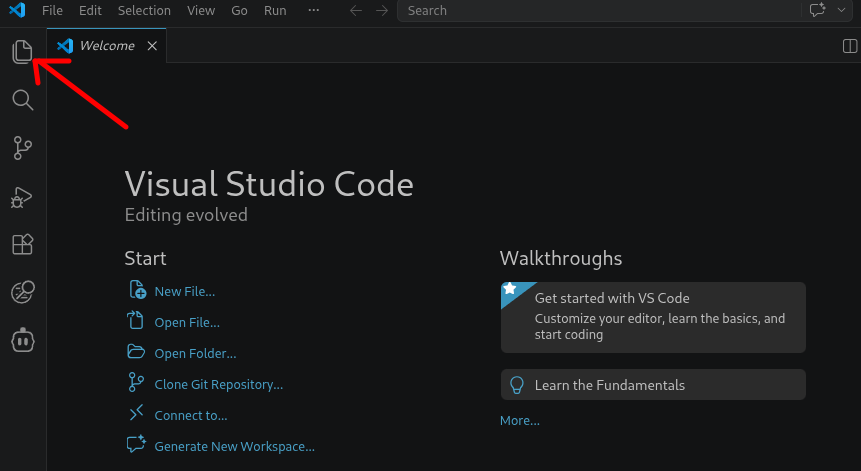
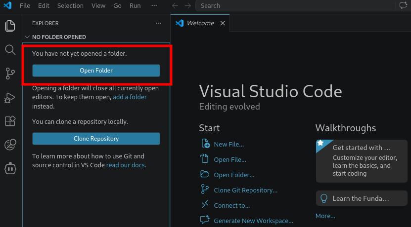
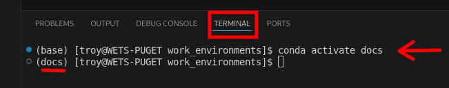
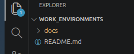
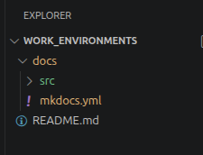

This section covers the initial configuration required to add MkDocs documentation to a GitHub repository and establish a local development environment.

This is not intended to be a comprehensive guide to MkDocs itself. If you would like to learn more about the project, visit the [official MkDocs website](https://www.mkdocs.org/).

In short, MkDocs uses Markdown files to generate modern, searchable documentation websites. Contributors can focus on writing content while MkDocs handles navigation, formatting, search, and site generation. Markdown is intentionally simple and easy to learn, making it accessible to both technical and non-technical contributors.

Many online resources are available to help you get started, including the official documentation, tutorials, videos, and AI-assisted tools such as ChatGPT, Claude, or GitHub Copilot.

Before documentation pages can be created and published, a repository must be configured with the required MkDocs files, directory structure, and development tools. In this section, we will:

* add MkDocs support to an existing GitHub repository
* configure a local development environment using VS Code
* create the initial documentation directory structure
* prepare the repository for local site generation and testing

Once this configuration is complete, contributors will be ready to begin creating documentation pages, previewing changes locally, and eventually publishing the site through GitHub Pages.

We will be using [VS Code](https://code.visualstudio.com/) because it allows us to perform nearly all documentation tasks from within a single application. This makes it an excellent environment for creating, editing, previewing, and publishing Markdown-based documentation.

## Identify Repository
GitHub natively supports and renders Markdown files (e.g., the "Readme.md" file). However, we want to go a step further to create a richer documentation for our repository using MkDocs.

Start by launching VS Code then open the explorer:
{#explorer}

## Open Repository
The Explorer provides two options. The first is open a **local** directory/folder and the second is to clone a **remote** repository. We have already gone over how to clone a repository from GitHub to your **local** machine, so we will assume the repository already exists locally and simply open it with option 1:

{#open}

You should now see a list of your repository contents in the Explorer window.

Next, we'll configure the development environment and create the files and folders required by MkDocs.

## Open a Terminal
From the VS Code menu bar, select `Terminal > New Terminal`

{#open_terminal}

## Activate the Virtual Environment
At the bottom of your screen, you should now see the **Terminal** panel open. By default, the working directory should match the repository location shown in the Explorer. The first thing we'll do is **activate** the Conda virtual environment used for building documentation. In this example, the environment is named ++"docs"++.

!!! warning "Check Point"
    This assumes you have followed the Python instructions to install Conda and create virtual environments. If you have not created a new virtual environment for building documents, I suggest doing this first:

    `conda create -n docs`

    In this environment you can keep all your tools for building documentation.

After you activate your virtual environment, you should see its name listed in parenthesis to the left:

{#activate_env}

## Install MkDocs
With your virtual environment activated, install MkDocs and the Material theme:

    conda install -c conda-forge mkdocs

    conda install -c conda-forge mkdocs-material

!!! warning "Do This Once"
    You don't need to install every time you **activate** your virtual environment, but you will need to install for a **newly created** environment.

The second command installs the Material theme, which is the theme used throughout this tutorial. You may have encountered other themes, such as `readthedocs` (used by projects like WEC-Sim), which is included with MkDocs by default. Themes control the appearance and navigation of the generated website while allowing authors to focus on writing content.
   
!!! note "Compatibility"
    At the time of writing, the MkDocs and Material projects are undergoing significant development. Future major releases are likely to introduce breaking changes, requiring updates to themes, plugins, or configuration files.

    This serves as a useful reminder that software dependencies evolve over time, and version compatibility can be important when maintaining documentation projects.

With the required packages installed, we are ready to create the documentation structure.

## Create the Documentation Directory
In the Explorer (or from the Terminal), create a new directory called `docs` (or any name you prefer). This directory will contain the documentation source files for your **repository**. In the next section, we will dive into MkDocs.

{#explorer_docs}

## Initial Project Structure
Inside the new `docs` directory (or whatever name you chose), create
* a new file called "mkdocs.yml"
* a nested directory/folder called "src"

The `mkdocs.yml` file contains the primary MkDocs configuration settings. The `/src` directory will contain the Markdown files and other assets used to build the documentation site.

!!! note "Directory Names Are Flexible"
    The official MkDocs [documentation](https://www.mkdocs.org/getting-started/) uses a directory named `docs` for source content. If you also place your MkDocs project inside a repository folder named `docs`, you may end up with paths such as:

    `/docs/docs/`

    Personally, I prefer to avoid this repetition, so I use `src` instead. You may use any directory name you like, provided the location is specified correctly in `mkdocs.yml`.

Your directory structure should look something similar to this:

    repository/
    └── docs/
        ├── mkdocs.yml
        └── src/
    
{#explorer_docs2}

With that, the development environment and project structure are fully configured. You now have everything needed to begin creating documentation pages for projects, tutorials, lesson plans, and technical references.

In the next section, we will walk through a typical documentation workflow, including creating pages, previewing changes locally, managing navigation, and preparing content for publication. As you will see, VS Code provides a convenient environment for performing all of these tasks from a single interface.