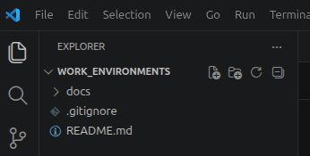

In the previous [Workflow](workflow.md) section, we focused on developing documentation locally using VS Code and a web browser for live previews. Once you are satisfied with the content, the documentation can be published directly through GitHub Pages.

## Publish with GitHub Pages
In the [VS Code terminal](config.md#open-a-terminal), with your virtual environment active, navigate to the directory containing ++"mkdocs.yml"++ and run:

    mkdocs gh-deploy

{#deploy}

MkDocs will automatically:

* build the documentation website,
* create or update a gh-pages branch,
* push the generated site to GitHub.

In the figure above, you can see `gh-deploy` automatically created a new branch called ++"gh-pages"++. Log in to GitHub, navigate to your repository, and you should now see two branches:

{#new_branch}

!!! warning "Do Not Edit ++"gh-pages"++ Branch"
    You generally do not need to interact with the ++"gh-pages"++ branch directly. Continue working on the ++"main"++ branch and let MkDocs manage deployment automatically.
    
    The ++"gh-pages"++ branch contains the generated website files and is recreated each time `mkdocs gh-deploy` is executed. Any manual changes made to this branch will likely be overwritten during the next deployment.

If this is the first time you have published documentation from the repository, verify the following settings in GitHub:

1. The repository is set to ++"public"++ (required for GitHub Pages on free personal accounts).
2. GitHub Pages is configured to deploy from the ++"gh-pages"++ branch.

These settings can be found in your repository ++"Settings"++ menu. The GitHub Pages configuration is located under the ++"Pages"++ settings:

{#deploy_from_branch}

Once GitHub Pages is configured, your documentation should become available within a few minutes at the URL provided in the ++"Pages"++ settings.

If you need to change the repository visibility, navigate to the  ++"Settings > General"++ menu and scroll to the bottom of the page under ++"Danger Zone > Change repository visibility"++.

## Commit Changes to GitHub
Publishing documentation makes the generated website available online, but it does not replace normal version control practices.

Remember to commit and push your source files back to the repository so that changes are preserved and available to other contributors.

Before doing so, it is good practice to tell GitHub to ignore generated build files. When MkDocs builds a website, it creates a `site/` directory containing the generated HTML, CSS, JavaScript, and other assets used by the published site. These files can always be regenerated from the source content and therefore do not need to be stored in the repository.

If a `site/` directory exists, your project structure may look something like:

    repository/
    └──docs/
        ├── mkdocs.yml
        ├── site/
        └── src/
            ├── index.md
            └── getting_started.md
    
Navigate to your main repository directory and create a new **hidden** file called ++".gitignore"++. 

    repository/
    ├── .gitignore
    └──docs/
        ├── mkdocs.yml
        ├── site/
        └── src/
            ├── index.md
            └── getting_started.md

!!! warning "Hidden Files"
    Hidden files begin with a **period** (.) followed by the name. Do not forget the leading period!

            
{#git_ignore}

Inside the file, on a new line, add:

    site/

and save the file.

We will commit this file first:

    git add .gitignore
    git commit -m "add gitignore file"
    git push

Now we can safely commit the remainder of our documentation while leaving any generated build files behind:

    git add --all
    git commit -m "Updated documentation"
    git push

Avoid leaving changes only on your local machine. The source files stored in the repository are the authoritative version of the documentation and should be kept synchronized with the published website.