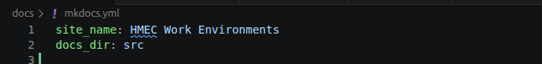
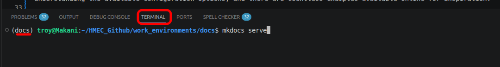
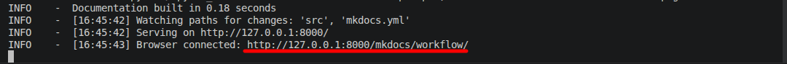
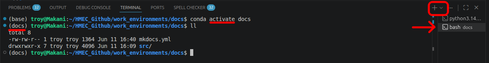
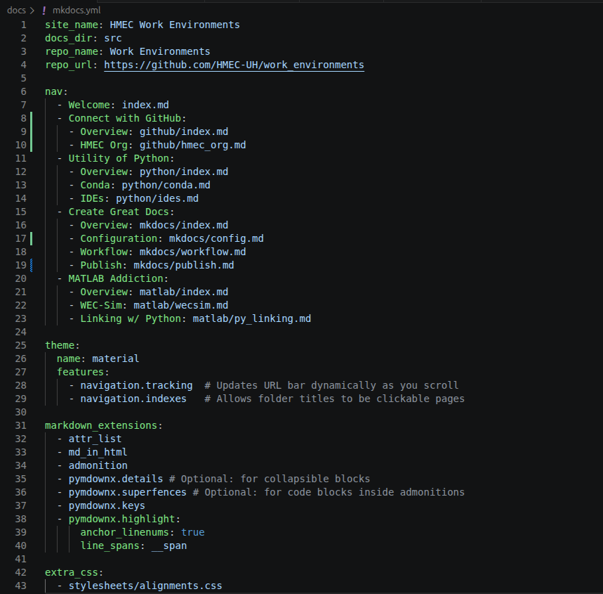

In the [Configuration](config.md) section, we installed [MkDocs](https://www.mkdocs.org/), created a project structure, and prepared a local development environment. With that foundation in place, we can begin creating documentation.

The workflow presented here is intentionally simple. Create content, preview it locally, make changes, and repeat. As your documentation grows, you can expand the structure and configuration as needed.

## Create a Minimum Working Example
At the end of the [Configuration](config.md) section, our project structure looked like:

    repository/
    └── docs/
        ├── mkdocs.yml
        └── src/

Open the ++"mkdocs.yml"++ file and add the following lines of code:

    site_name: My Docs
    docs_dir: src

where "My Docs" is simply the title of your page. The file contents should look something like this:

{#min_config}

This is the minimum configuration required for MkDocs to generate a website.

## Launch the Development Server
With the minimum configuration in place, return to the [VS Code terminal](config.md#open-a-terminal). Ensure your virtual environment is active, then start the **local** development server:

    mkdocs serve

{#launch_server}

Upon pressing enter, the terminal should display a local address similar to: `http://127.0.0.1:8000/`

{#server_running}

Open this address in a web browser. You should immediately see your documentation site. While there is not much content to display yet, this confirms that MkDocs is installed correctly and that your local development environment is working as expected.

During development, it is often helpful to leave both the browser and server running. As you modify and save files, MkDocs will automatically rebuild the site and refresh the displayed content.

If you need another terminal while the server is running, simply open a new terminal window:

{#new_terminal}

However, remember to activate your virtual environment if you plan to run any `mkdocs` commands.

## Create Documentation Pages
The source content for your documentation lives in the `\src` directory. To create a new page, simply add a Markdown file.

For example:

    src/
    ├── index.md
    └── getting_started.md

Each Markdown file becomes a documentation page that can be included in the site navigation. Markdown is intentionally simple and easy to learn. While some advanced features depend on the MkDocs theme and extensions being used, most Markdown syntax is universal across platforms. If you're new to Markdown, this online [cheat sheet](https://github.com/adam-p/markdown-here/wiki/markdown-cheatsheet) is a handy reference.

MkDocs supports nested directories, allowing content to be organized however best fits your project.

## Configure Site Navigation
As your documentation grows, you will typically update ++"mkdocs.yml"++ to define navigation menus, themes, extensions, and other site settings.

Every project is different, so we will not examine every configuration option here. The [official MkDocs website](https://www.mkdocs.org/) contains extensive examples, and modern AI tools can often help generate or modify configurations for specific needs.

The example below shows a snapshot of the configuration file used for this documentation:

{#config_yml_example}

## Develop and Iterate
The most common workflow is:

1. Create or modify Markdown content.
2. Save the file.
3. Review the result in your browser.
4. Make adjustments.
5. Repeat.

Because MkDocs automatically rebuilds the site while the development server is running, documentation can be developed very quickly with immediate visual feedback.