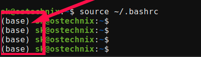

# Conda
Managing Python dependencies manually is generally impractical for computing workflows. Fortunately, several package managers are available to simplify environment and dependency management. At HMEC, the primary package manager used is "Conda", which is distributed through several interfaces and installations, including:

* [Anaconda](https://www.anaconda.com/) — a full scientific Python distribution that includes Conda along with many pre-installed packages and graphical tools (large installation)
* [Miniconda](https://www.anaconda.com/docs/getting-started/miniconda/main) — a lightweight Conda installer that provides only the core package and environment manager
* [Miniforge](https://conda-forge.org/miniforge/) — a community-maintained Conda distribution that emphasizes open-source packages and the conda-forge ecosystem

## Miniconda
For most users in this course, Miniconda or Miniforge will be sufficient and are generally preferred due to their smaller installation size and greater flexibility. In this course, we will use Miniconda, while frequently installing packages from the `conda-forge` channel, a community-maintained repository that serves as the default package source for Miniforge.

Head over to the Miniconda, download the [installation tool](https://www.anaconda.com/download/success) and follow the instructions for your OS.

!!! note "On Windows"
    You will be using the [Anaconda Prompt](https://www.anaconda.com/docs/getting-started/miniconda/install/windows-gui-install#verify-your-install) to access your command line terminal.

Once you get everything installed — assuming you side "yes" to initialize — your command prompt should include ++"(base)"++ to indicate that the "base" environment is active:

{#conda-prompt}

*Figure 1: The active Conda environment appears next to name.*

!!! error "Check Point"
    If you haven't reached this point, STOP, and return the the [installation documents](https://www.anaconda.com/docs/getting-started/miniconda/install/overview). They cover this verbatim and their docs should be the primary source of knowledge.

Now that Miniconda is installed, we can create isolated Python environments for your work. These environments act as self-contained workspaces where you can install packages, experiment freely, and make changes without affecting your system-wide Python installation. If an environment becomes unstable or misconfigured, it can simply be removed and recreated from scratch.

