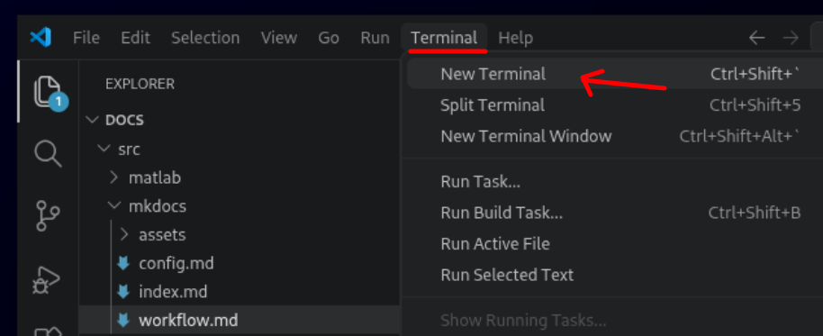
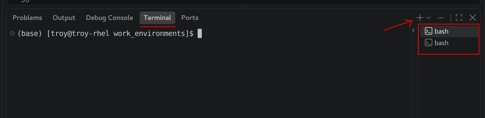
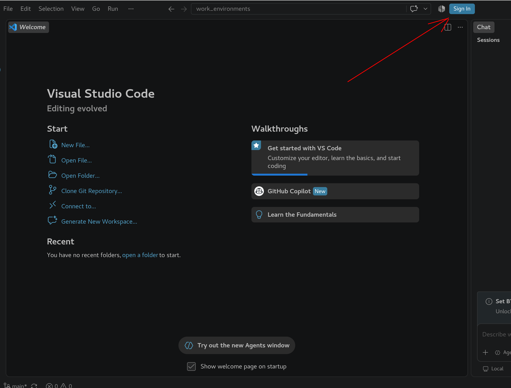
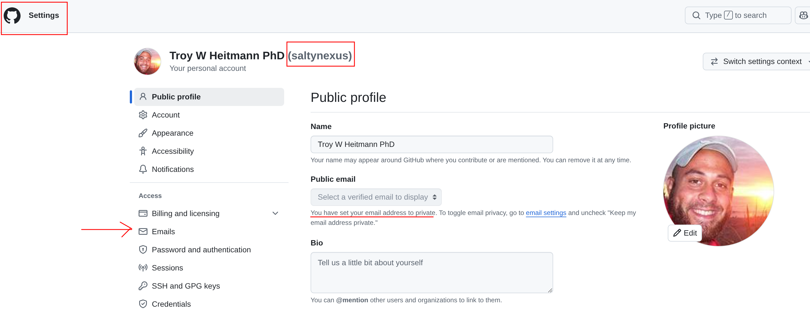
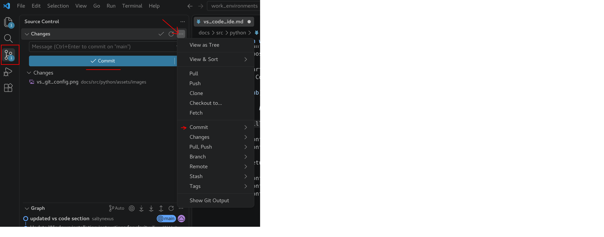
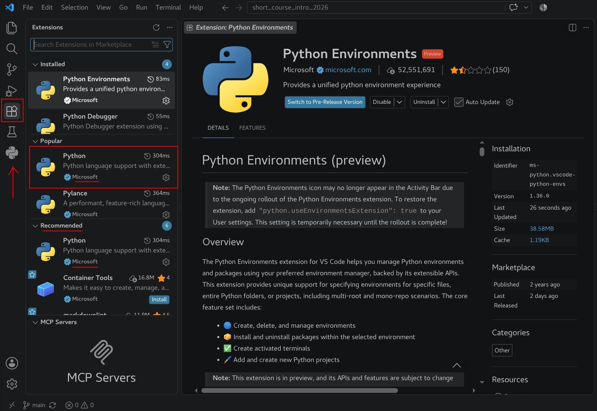
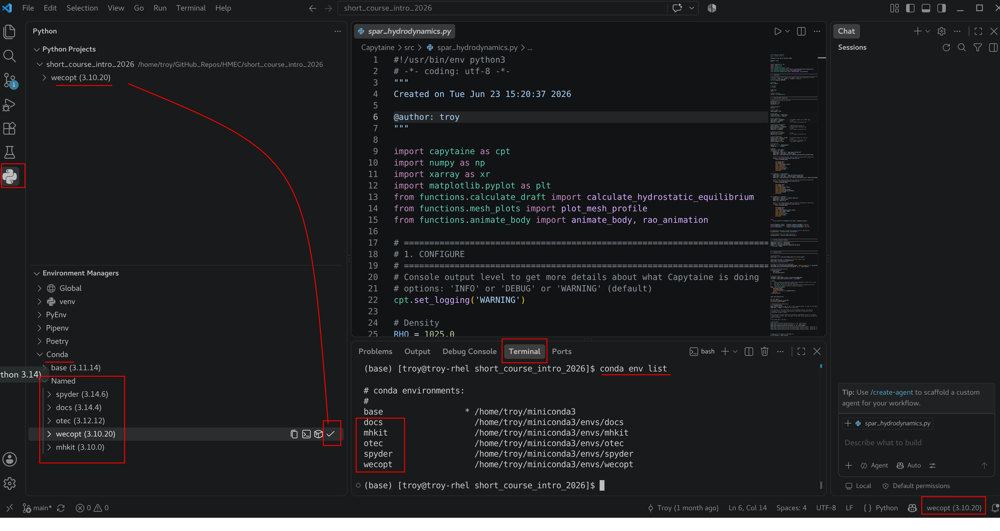

Visual Studio Code (VS Code) is a free, cross-platform source code editor developed by Microsoft. Unlike a traditional integrated development environment (IDE), VS Code starts as a relatively lightweight editor and can be extended with additional functionality depending on the languages and tools you use.

For Python development, VS Code provides a flexible environment for writing, running, and debugging Python code. With the appropriate extensions installed, VS Code can provide many of the features commonly associated with a full Python IDE, including:

- Syntax highlighting and code completion to make Python code easier to read and write.
- Integrated debugging for stepping through code, setting breakpoints, and inspecting variables.
- Python environment selection for working with Conda and other virtual environments.
- An integrated terminal for running Python, managing environments, installing packages, and using command-line tools without leaving the editor.
- Jupyter support for working interactively with notebooks and individual code cells.
- Project and file management for organizing larger Python projects containing multiple scripts, modules, data files, and documentation.
- Git integration for tracking changes and working with version-controlled projects.

One of the major advantages of VS Code is that the same development environment can grow with your workflow. It works well for relatively simple Python scripts, but it is also well suited to larger projects that combine Python with tools such as Git, Jupyter notebooks, documentation, configuration files, and command-line applications.

In the following sections, we will install VS Code, add the extensions needed for Python development, and configure it to work with our Python environments.

## Install
VS Code is cross-platform and is available for Windows, macOS, and Linux. Head over to the VS Code [download page](https://code.visualstudio.com/download?_exp_download=fb315fc982) and download the installer appropriate for your operating system.

Follow the installation instructions provided for your platform. For most users, the default installation options are appropriate.

Once the installation is complete, launch Visual Studio Code. The first time you open VS Code, you will be presented with the Welcome page. At this point, VS Code is primarily a general-purpose code editor. In the next section, we will install a few recommended extensions that provide additional tools and features for Python development.

## Terminal
VS Code includes an integrated terminal, allowing you to access the command line without leaving the editor. This is particularly useful for Python development because we can use the terminal to activate Conda environments, install packages, run Python scripts, execute Git commands, and interact with other command-line tools while working on a project.

From the VS Code menu bar, select `Terminal > New Terminal`

{#open_terminal}

A terminal will open in a panel along the bottom of the VS Code window. This is a regular system terminal running within VS Code, so the commands available to you will depend on your operating system and configured shell.

!!! note "Multiple Terminals"
    You can open multiple terminals at the same time. This can be useful when you want to keep one terminal associated with a particular Conda environment or have a long-running process active while using another terminal for additional commands.

{#new_terminal}

## Sign in with GitHub
VS Code can connect directly to your GitHub account, allowing you to work with GitHub repositories and integrate GitHub with your development environment.

To get started, click the ++"Sign In"++ button located near the upper-right corner of the VS Code window, as shown below. Select Sign in with GitHub and follow the prompts to authorize VS Code to access your GitHub account.

{#vs_github}

*Figure 1: Login with Github.*

In addition to signing in to GitHub, Git needs a name and email address to identify the author of each commit. These settings are stored separately from your GitHub login and should be configured before making your first commit.

Launch a ++"Terminal"++ in VS Code and run the following two commands to check your current configuration:

    git config user.email
    git config user.name

If either command returns a blank result, that value will need to be configured.

### Assign Git username and email
Technically, the name and email recorded by Git can be whatever you choose, and they can even be configured differently for individual repositories. However, for consistency, we will configure them globally and use information associated with your GitHub account.

Using an email address associated with your GitHub account is particularly useful because it allows GitHub to associate your commits with your account. If you prefer not to expose your personal email address in the public commit history, GitHub provides a private noreply email address that can be used instead.

Log in to GitHub and navigate to ++"Settings"++. Take note of your GitHub username, as shown below. To configure your Git author name globally, execute the following command in the ++"Terminal"++:

    git config --global user.name "your_github_username"

where ++"your_github_username"++ is a placeholder that should be replaced with your own GitHub username.

{#vs_git_config}

*Figure 2: Identifying Github username and email.*

As shown in the figure above, my email address is configured as private, so I use the private email address generated by GitHub. Selecting ++"Emails"++ from the GitHub settings menu allows you to review your email addresses and configure your email privacy settings.

Once you have identified the GitHub-associated email address you want to use, configure Git using the appropriate option below:

  
Public Email

    git config --global user.email "your_github_email@example.com"

  
Private Email

    git config --global user.email "12345678+username@users.noreply.github.com"

!!! note "Placeholders"
    If you see generic text such as **your_github_email@example.com**, this is a placeholder prompting you to enter your own information. It is provided only to demonstrate the required syntax.

You can verify your configuration by running:

    git config user.name
    git config user.email

With Git configured and VS Code connected to GitHub, you can use VS Code's graphical interface to perform many common version-control operations. Expand the ++"Source Control"++ panel on the left side of the VS Code window and select the desired repository. The panel should look similar to the example below and provides access to many commonly used Git tools.    

{#vs_git_actions}

*Figure 3: VS Code Source Control Panel.*

## Python Extensions
VS Code is designed as a general-purpose code editor rather than an IDE dedicated to a particular programming language. Much of its functionality is provided through extensions, which are optional add-ons that introduce support for different programming languages, development tools, and workflows.

For Python development, Microsoft provides a collection of extensions that add Python-specific capabilities to VS Code. We will begin by installing the primary Python extension.

Select the ++"Extensions"++ icon from the Activity Bar along the left side of the VS Code window, as shown below. This opens the Extensions panel, where you can search the Visual Studio Marketplace for available extensions.

Enter ++"Python"++ into the search bar and locate the Python extension published by **Microsoft**. Verify that Microsoft is identified as the publisher, then select ++"Install"++. After the installation is complete, you should see the Python icon appear in the Activity Bar along the left side of the VS Code window, as indicated in the figure below.

{#vs_extension}

*Figure 4: Adding Microsoft Python Extension to VS Code.*

The Microsoft Python extension adds the core Python language support needed to turn VS Code into a more capable Python development environment. It also integrates with additional Python tools for features such as code completion, debugging, environment management, and code analysis.

During installation, VS Code may automatically install or recommend additional Microsoft extensions that work alongside the Python extension. For example, you may see extensions such as Pylance, Python Debugger, and Python Environments appear in the Extensions panel. These components provide additional functionality and may evolve as Microsoft's Python tooling for VS Code is updated.

## Setting Python Interpreter 
When working with Python in VS Code, we need to tell VS Code which Python environment to use for our project. This determines the **Python interpreter** and installed packages that VS Code will use when running and debugging our code.

Select the Python icon from the Activity Bar along the left side of the VS Code window. This opens the Python panel, which provides tools for managing Python projects and environments.

Near the bottom of the panel, expand ++"Environment Managers"++. Since we previously installed Conda, it should appear as one of the available environment managers. Expand ++"Conda"++, followed by ++"Named"++, to display the Conda environments available on your computer.

{#vs_extension2}

*Figure 5: Python Environment Managers.*

These are the same Conda environments that we have been working with from the command line. To demonstrate this, open a ++"Terminal"++ and execute:

    conda env list

Compare the environments listed in the terminal with those displayed under ++"Conda > Named"++ in the Python panel. As shown in the figure above, there should be a direct correspondence between the Conda environments discovered by VS Code and those reported by Conda.

Under ++"Conda > Named"++, locate the environment you want to use for the current project. Hover over the environment and select the checkmark to set it as the project's Python environment.

Once selected, the environment name and Python version will appear in the status bar near the lower-right corner of the VS Code window. In the example above, the selected environment is:

    wecopt (3.10.20)

This indicates that VS Code is configured to use the **Python interpreter** associated with the ++"wecopt"++ Conda environment.

Selecting an environment here does more than simply identify a Conda environment by name. Each Conda environment contains its own **Python interpreter** and collection of installed packages. By selecting ++"wecopt"++, for example, we are telling VS Code to use the Python executable and packages installed within that environment when working with our project.

!!! tip
    The selected Python environment is displayed in the VS Code status bar. Before running Python code, it is a good habit to glance at this indicator and verify that VS Code is using the environment you expect.

## Where to Go From Here

VS Code is an extremely flexible development platform, and we have only scratched the surface of what it can do. Through its extensive library of extensions, VS Code can be customized to support different programming languages, development workflows, version-control systems, remote computing resources, notebooks, debugging tools, and much more.

The configuration presented here is intentionally kept relatively simple. Our goal is to establish a useful Python development environment without overwhelming ourselves with features that we may not need.

For scientific computing, I still frequently rely on the [Spyder IDE](spyder_ide.md). One of the primary reasons is its **Variable Explorer**, which provides a convenient graphical view of the variables currently stored in an interactive Python session. This is particularly useful when working with NumPy arrays, pandas DataFrames, and other numerical data structures where inspecting intermediate results is an important part of the development process.

There are ongoing efforts to bring similar functionality to VS Code. The VS Code Extension Marketplace includes projects such as **Spyder Variable Explorer** and **Variable Explorer**, which attempt to provide a more Spyder-like interactive scientific-computing workflow within VS Code. Microsoft's Jupyter tools also provide variable and data inspection capabilities when working through an interactive Jupyter session.

These tools are worth exploring, but we will not make them part of our standard configuration at this time. Extensions—particularly newer community-developed projects—can change rapidly, and adding more components also adds complexity to our development environment.

As you become more comfortable with VS Code, I encourage you to explore its extensions and features and adapt the editor to fit the way **you** prefer to work. The setup described here should be viewed as a starting point rather than a definitive VS Code configuration.